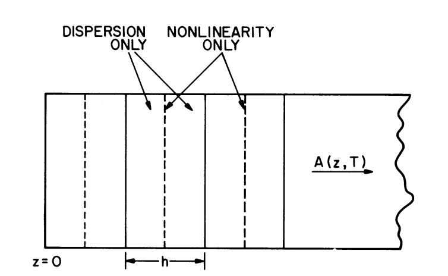
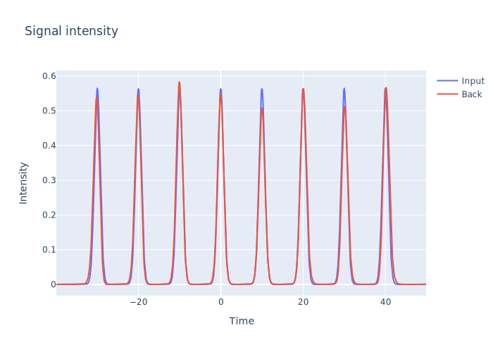
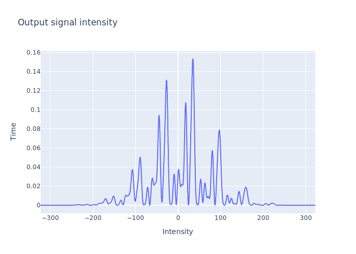
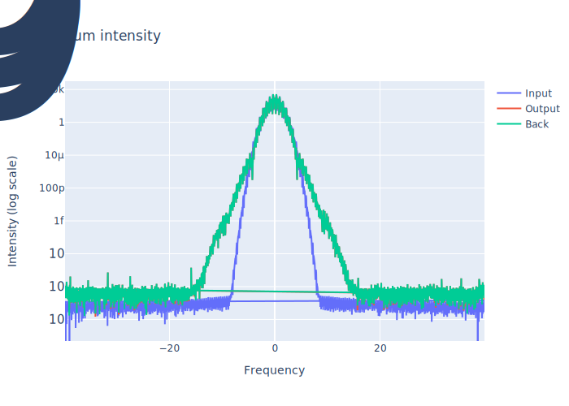

# Solution of the nonlinear Schrödinger equation using cuFFT
High Performance Computing and Modern Architectures course
Final project
Ilya Kuk

## Running template:

`./NLSE.exe <seq_len> <dim_t> <dispersion> <nonlinearity> <pulse_width> <z_end> <z_step>`

## Example of running application:

`./NLSE.exe 8 8192 0.5 0.05 10 100 0.1`

## Split-step method

## Plots

 <b>Input and back propagated signal intensity</b> 

 <b>Output signal intensity</b> 

 <b>Spectrum</b> 

